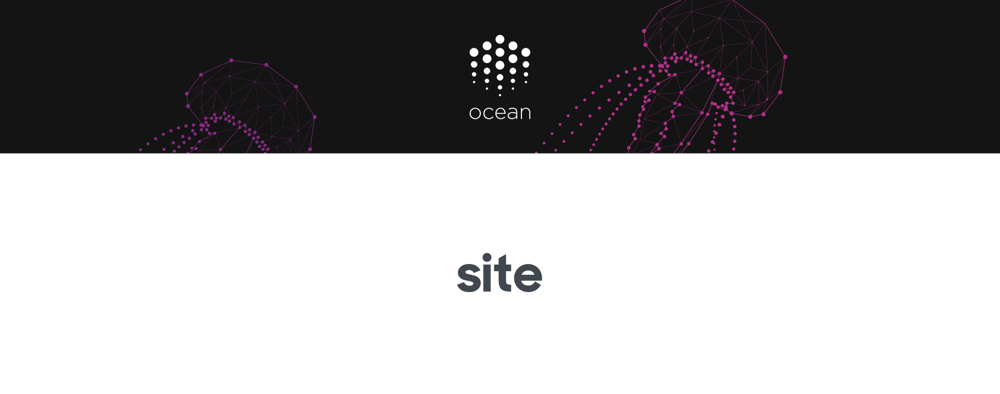

[](https://oceanprotocol.com)

> 🐠 Landing page for Ocean Protocol https://oceanprotocol.com

[](https://travis-ci.com/oceanprotocol/site)
[](https://github.com/bigchaindb/stylelint-config-bigchaindb)
[](https://github.com/ascribe/javascript)

---

[**Live**](https://oceanprotocol.com) | [**Beta**](https://beta.oceanprotocol.com)

---

## Table of Contents

- [Content](#content)
    - [Papers](#papers)
    - [Blog posts](#blog-posts)
    - [Videos](#videos)
- [Forms](#forms)
- [Development](#development)
    - [Environment variables](#environment-variables)
    - [Workflow](#workflow)
    - [Code style](#code-style)
- [Deployment: always be shipping](#deployment-always-be-shipping)
    - [Manual Deployment](#manual-deployment)

## Content

Most copy is mixed within the HTML and JSX markup in the files under `src/sections/`. The following content has been isolated in json data files in the `src/data/` directory and can be edited there:

- FAQ: `faq.json`
- Events: `events.json`
- Team: `team.json`
- Roadmap: `roadmap.json`

### Events

Events can be added to the events section on the front page by editing the [`src/data/events.json`](src/data/events.json) file, and committing the result in a new Pull Request. 

On the events section, all events are automatically sorted chronologically by the `date` value, and past events are put into the archive modal. So the order of the events in the `events.json` file doesn't matter.

### `date` & `date_end`

When adding a multi-day event, don't use the full event range but only the date one of the team members is actually present at an event. This is usually just one day, e.g. when giving a talk. Only add the optional `date_end` when our presence at an event is confirmed for multiple days.


### Papers

All pdf documents are simply put into the `public` folder, making them available under the root `/` of the live site.

An exception is the technical whitepaper which is sourced from the [`oceanprotocol/whitepaper`](https://github.com/oceanprotocol/whitepaper) submodule  in `src/lib/whitepaper` and automatically copied in place before deployment.

### Blog posts

All displayed posts in the Blog section are sourced from our Medium publication under blog.oceanprotocol.com.

Website only communicates with an endpoint created via webtask.io, where the task on webtask.io communicates directly with the Medium RSS feed. See [oceanprotocol/webtasks](https://github.com/oceanprotocol/webtasks) for details.

### Videos

All displayed movies in the Videos section are sourced from a hidden YouTube playlist named `website` in our channel.

Website only communicates with an endpoint created via webtask.io, where the task on webtask.io communicates directly with the YouTube Data API v3 setup in Google Cloud Platform. See [oceanprotocol/webtasks](https://github.com/oceanprotocol/webtasks) for details.

## Forms

We have the following forms on our website collecting lead data:

- *Newsletter subscription*: Email
- *Join as Data Provider*: Name, Email, Company, Comment
- *Join as Data Consumer*: Name, Email, Company, Comment
- *Join as Contributor*: Name, Email, Role, Comment

All data is currently collected on MailChimp where each form submission is put into a respective list. All form submissions make use of MailChimp's undocumented `jsonp` functionality, NOT the MailChimp API.

Via Zapier, the data is synced further in real time when new submissions happen:

- the Data Provider, Data Consumer, and Contributor data into Slack channel #form-submissions in real time
- the Data Provider, Data Consumer, and Contributor data into Google Sheets

## Development

The site is a single page React app, created with [`create-react-app`](https://github.com/facebook/create-react-app).

To start development, clone this repo, install all dependencies, and start the development server:

```bash
git clone --recurse-submodules git@github.com:oceanprotocol/site.git
cd site/

# copy and move environment variables file in place
mv .env.example .env

npm i
npm start
```

### Environment variables

A `.env` file is used to inject environment variables during local development. We're using `create-react-app` so all variables need to be prefixed with `REACT_APP_` to get picked up.

Environment Variable | Usage
---------|---------
`REACT_APP_ANIMATE_WAVES` | Set to `false` to stop the waves from executing, saving your laptop battery.
`REACT_APP_ANIMATE_PROJECT` | Set to `false` to disable the Project data dots animation. Takes away some stress from your GPU, saving your laptop battery.

### Workflow

Work happens only in the `oceanprotocol/site` repository, no need to fork it to your account. Following a Git feature branch workflow, always start by branching off from an updated `master`:

```bash
git checkout master
git pull
git branch -b feature/mycoolnewfeature

# first push: publish branch and setup as remote tracking branch
git push -u origin feature/mycoolnewfeature
# all subsequent pushes
git push
```

Do work in your feature branch, committing early and often. You can open a Pull Request on GitHub as early as you want to discuss further implementation on it and check it out on beta.oceanprotocol.com. Just make sure to mark it as _Work in Progress_ in the PR description and/or by applying the respective label.

Make sure to rebase your branch from time to time against upstream changes. Avoid using GitHub's auto-merge button on a Pull Request to keep the Git history more clean. You can do a rebase like so:

```bash
git checkout master
git pull
git checkout feature/mycoolnewfeature
git rebase master
```

Be aware that you have to force push after a rebase if you have published your branch already:

```bash
git push -f
```

Once ready, request a review of your Pull Request from a team member, fixing possible change requests. Once approved, you can merge your Pull Request and delete the branch afterwards.

### Code style

Code style for JavaScript and stylesheets (we're using [styled-components](https://www.styled-components.com)) is enforced before every commit. You won't be able to commit any code with linting errors present so make sure to fix all warnings before committing.

Code style follows [eslint-config-ascribe](https://github.com/ascribe/javascript) and [stylelint-config-bigchaindb](https://github.com/bigchaindb/stylelint-config-bigchaindb).

## Deployment: always be shipping


The site is hosted in a S3 bucket `oceanprotocol.com`, with DNS setup in Cloudflare. Cloudflare provides SSL certificate, among other things. The site gets built & deployed automatically via Travis which is the preferred way of deployment. It makes sure the site is always deployed with fresh dependencies and only after a successful test & build.

Build & deployment happens under the following conditions on Travis:

- every push tests & builds the site
- **live deployment**: every push to the master branch initiates a live deployment
- **beta deployment**: every new pull request and every subsequent push to it initiates a beta deployment

Travis requires the following environment variables to be setup for successful deployments:

- `AWS_ACCESS_KEY_ID`
- `AWS_SECRET_ACCESS_KEY`
- `AWS_DEFAULT_REGION`
- `CLOUDFLARE_EMAIL`
- `CLOUDFLARE_ZONE`
- `CLOUDFLARE_KEY`

### Manual Deployment

Create fresh production build and sync with S3, needs proper credentials in `~/.aws/credentials`.

```bash
npm run build
AWS_PROFILE=ocean aws s3 sync ./build s3://oceanprotocol.com --delete --acl public-read
```
