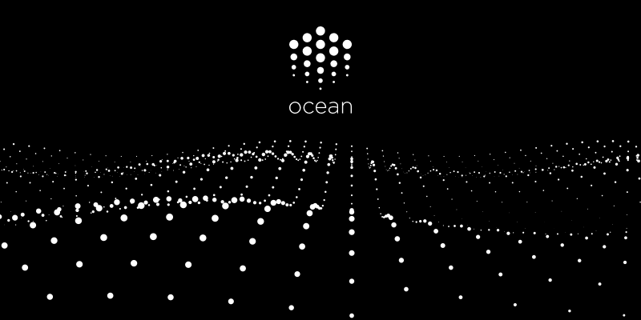

# Ocean Protocol Site



[](https://travis-ci.com/oceanprotocol/site)
[](https://github.com/bigchaindb/stylelint-config-bigchaindb)
[](https://github.com/ascribe/javascript)

> Landing page for Ocean Protocol https://oceanprotocol.com

---

[**Live**](https://oceanprotocol.com) | [**Beta**](https://beta.oceanprotocol.com)

---

## Table of Contents

- [Content](#content)
    - [Blog posts](#blog-posts)
    - [Videos](#videos)
- [Development](#development)
- [Deployment: always be shipping](#deployment-always-be-shipping)
    - [Manual Deployment](#manual-deployment)

## Content

Most copy is mixed within the HTML and JSX markup in the files under `src/sections/`. The following content has been isolated in json data files in the `src/data/` directory and can be edited there:

- FAQ: `faq.json`
- Events: `events.json`
- Team: `team.json`

### Blog posts

All displayed posts in the Blog section are sourced from our Medium publication blog.oceanprotocol.com. Website only communicates with an endpoint created by webtask.io, where the task on webtask.io communicates directly with the Medium RSS feed.

### Videos

All displayed movies in the Videos section are sourced from a hidden YouTube playlist named `website` in our channel. Website communicates directly with the YouTube Data API v3 setup in Google Cloud Platform.

This API has a limit of 1,000,000 requests per day. Depending on our website traffic, this quota could make the videos section fail to load.

## Development

The site is a single page React app, created with `create-react-app`.

```bash
npm i
npm start
```

## Deployment: always be shipping


The site gets built & deployed automatically via Travis. This is the preferred way of deployment, it makes sure the site is always deployed with fresh dependencies and only after a successful test & build.

Build & deployment happens under the following conditions on Travis:

- every push tests & builds the site
- **live deployment**: every push to the master branch initiates a live deployment
- **beta deployment**: every new pull request and every subsequent push to it initiates a beta deployment

Travis requires the following environment variables to be setup for successful deployments:

- `AWS_ACCESS_KEY_ID`
- `AWS_SECRET_ACCESS_KEY`
- `AWS_DEFAULT_REGION`
- `CLOUDFLARE_EMAIL`
- `CLOUDFLARE_ZONE`
- `CLOUDFLARE_KEY`

### Manual Deployment

Create fresh production build and sync with S3, needs proper credentials in `~/.aws/credentials`.

```bash
npm run build
AWS_PROFILE=ocean aws s3 sync ./build s3://oceanprotocol.com --delete --acl public-read
```
